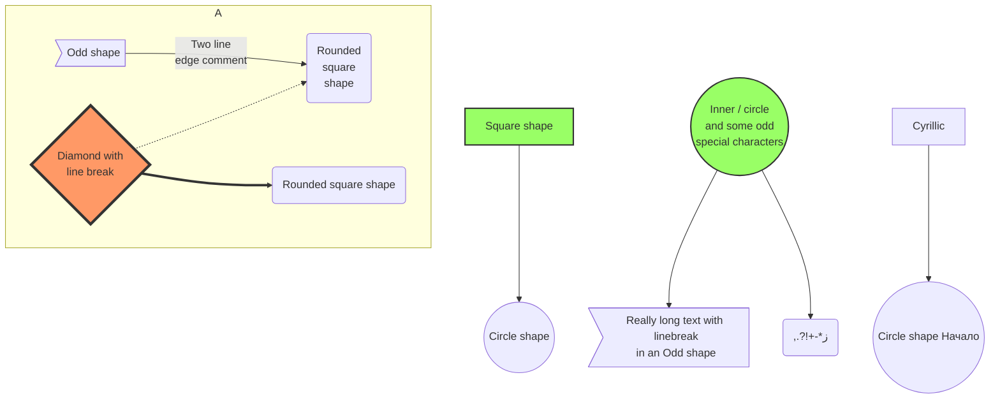
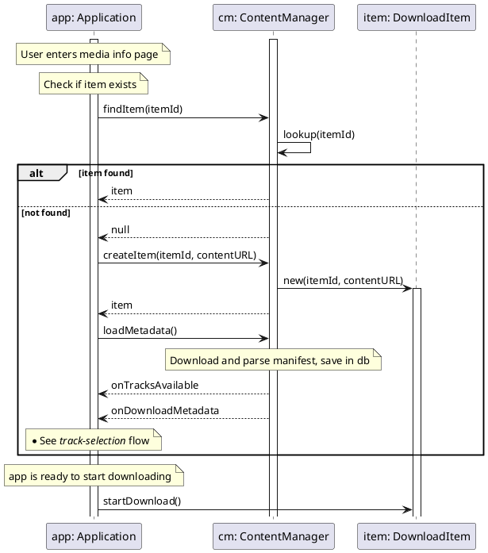

[toc]

# docker-markdown-to-pdf-with-figures-example-doc


## Diagrams

### mermaid




### PlantUML

https://real-world-plantuml.com/umls/4606798564687872




### D2

```d2 {kroki=true}
ibm: IBM "Espresso" CPU {
  core0: IBM PowerPC "Broadway" Core 0
  core1: IBM PowerPC "Broadway" Core 1
  core2: IBM PowerPC "Broadway" Core 2

  rom: 16 KB ROM

  core0 -- core2

  rom -> core2
}

amd: AMD "Latte" GPU {
  mem: Memory & I/O Bridge
  dram: DRAM Controller
  edram: 32 MB EDRAM "MEM1"
  rom: 512 B SEEPROM

  sata: SATA IF
  exi: EXI

  gx: GX {
    3 MB 1T-SRAM
  }

  radeon: AMD Radeon R7xx "GX2"

  mem -- gx
  mem -- radeon

  rom -- mem

  mem -- sata
  mem -- exi

  dram -- sata
  dram -- exi
}

ddr3: 2 GB DDR3 RAM "MEM2"

amd.mem -- ddr3
amd.dram -- ddr3
amd.edram -- ddr3

ibm.core1 -- amd.mem

```
